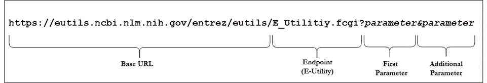

# E-Utilities Reference Guide

## E-Utilties API URL

E-Utility API query URLs have three parts:

* Base URL
* E-Utility endpoint
* One or more parameters

See Figure 1 below.

Figure 1. Parts of the Entrez API Query

